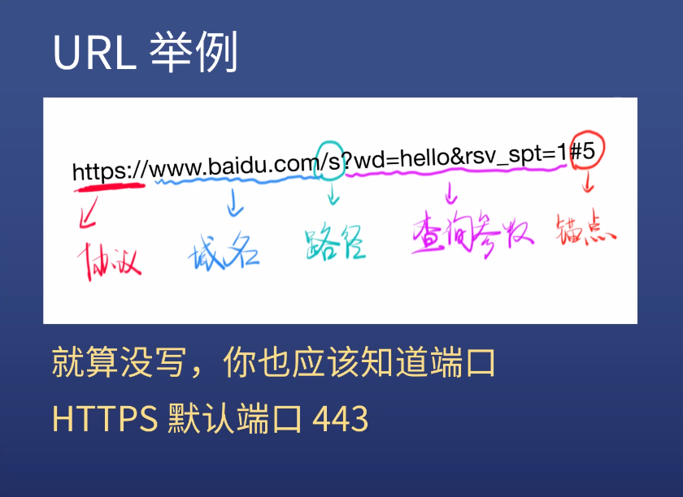
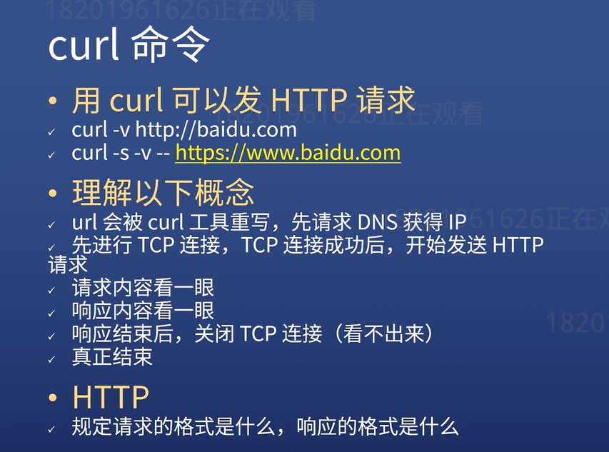

# 浅析 URl

## URL 统一资源定位服务

Uniform Resource Locator  
  
_图片来源杭州饥人谷教程_

- URL 包括以下几个部分：
  1. 协议：https/http
  2. 域名或 IP：baidu.com
  3. 端口号：有些默认不写（比如 http 443）
  4. 路径：同一网站，不同**页面**
  5. 查询参数字符串：同一页面，不同**内容**
  6. 锚点：同一内容，不同**位置**
     - 锚点不支持中文
     - 锚点不发送给服务器，只跟浏览器有关

## curl 命令（命令行）

- 用 curl 可以发 HTTP 请求

  1. curl -v http://baidu.com
  2. curl -s -v -- http://www.baidu.com

  
_图片来源杭州饥人谷教程_

## IP（用来确定设备）

- ipconfig 查看本机 IP 配置
- 外网 ip

  - 查外网 ip 地址网站：
    [点击查询](https://www.ip38.com/)

  - 但是如果重启路由器，路由器可能会重新分配到一个新的外网 ip

- 内网 ip
  192.168.x.x

- 路由器的功能

  1. 路由器有两个 IP，一个外网 IP 和一个内网 IP
  2. 内网设备可以互相访问，但不能直接访问外网
  3. 内网设备访问外网必须经过路由器中转
  4. 外网设备把内容送到内网，也必须通过路由器

- 几个特殊的 IP

  1. 127.0.0.1 表示自己
  2. localhost 通过 hosts 指定为自己
  3. 0.0.0.0 不表示任何设备

- host 文件
  host 文件位置：C:\Windows\System32\drivers\etc\hosts
  以管理员身份用记事本打开
  加上：
  127.0.0.1 任意字符串（比如 abc）
  则 abc 即可表示自己
  - 通过以上方法可以让任意字符串表示对应的 IP

## 端口 port（用来确定服务）

- 查端口，用[维基百科](https://zh.wikipedia.org/wiki/TCP/UDP%E7%AB%AF%E5%8F%A3%E5%88%97%E8%A1%A8#0.E5.88.B01023.E5.8F.B7.E7.AB.AF.E5.8F.A3)
- http-server 默认使用 8080 端口
- 0 至 1023 端口是留给系统使用的
- 端口被占用，只能换一个端口
- http-80 端口
- https-443 端口

## IP + 端口

- 确定某设备的某服务
- IP 和端口缺一不可

## 域名

- ping 一个网址（如：baidu.com）  
  可以得到 baidu.com 的回复  
  可以看到 baidu.com 的 IP
- 一个域名可以对用不同 IP  
  这个叫做负载均衡，防止一台机器扛不住
- 一个 IP 也可以对应多个域名  
  这个叫做共享主机，穷开发者会这么做

- DNS 服务器

  1. 查 IP：nslookup + 网址

- 域名级别

  1. com 是一个顶级域名
  2. xiedaimala.com 是二级域名（俗称一级域名）
  3. www.xiedaimala.com 是三级域名（俗称二级域名）
  4. 二级和三级 他们是父子关系
  5. 所以 www.xiedaimala.com 和 xiedaimala.com 可以不是同一家公司，也可以是
  6. www 是多余的吗？是的，非常多余。
